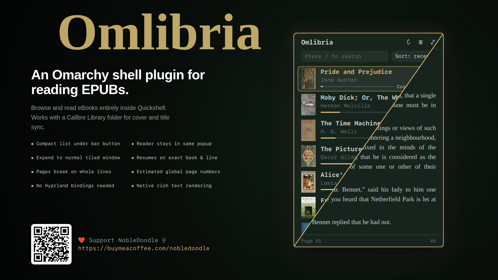

# Omlibria



An Omarchy shell plugin that allows you to browse and read eBooks (EPUB),
entirely inside Quickshell.

Works with a Calibre Library folder for cover and title sync.

- **Compact menu**: pressing the bar icon drops a compact list right under
  the button: covers, author, series and reading progress for every EPUB.
- **Reader stays compact**: picking a book reads it in that same small popup.
- **Expand**: the ⤢ button (or `e`) opens the reader in a normal tiled window,
  and back to the popup again. Position carries over.
- **Resume**: pressing the icon after closing reopens on the exact book and
  line you left, even after a font or size change.

No Hyprland bindings are installed. Keys only act while the popup or window
has focus.

## Install

```bash
omarchy plugin add https://github.com/NobleDoodle/omlibria --enable
```

That clones the plugin into
`~/.config/omarchy/plugins/io.github.nobledoodle.omlibria/`, turns it on, and
puts a book icon in your bar. There is no build step, and nothing requires
privileged access. Omarchy adds plugins *disabled* unless you pass `--enable`,
so you can also leave the flag off, read the code first, then run
`omarchy plugin enable io.github.nobledoodle.omlibria`.

**First run:** click the book icon. Omlibria lists any Calibre library it can
find (a folder containing `metadata.db`), or you can type a path.

You can create a library folder with Calibre so that it generates a
`metadata.db` file, but Calibre does not need to be installed to keep using the
plugin.

**Requirements:** Omarchy 4 (developed and tested on 4.0.4) and `python3`
(standard library only, nothing to install).

**Update or remove:**

```bash
omarchy plugin update io.github.nobledoodle.omlibria
omarchy plugin remove io.github.nobledoodle.omlibria
```

**Manual install:** download the repository as a ZIP from GitHub and unpack it
to `~/.config/omarchy/plugins/io.github.nobledoodle.omlibria/` (the folder name
must match the plugin id), then run:

```bash
omarchy-shell shell rescanPlugins
omarchy plugin enable io.github.nobledoodle.omlibria
```

Left-click the bar icon to open or close it; it resumes your book. Right-click
opens the library list even if you were mid-book.

## Keys

Press `?` in either view for the cheat sheet.

| Library | |
|---|---|
| `j` `k` / `↑` `↓` | move |
| `g` `G` | first / last |
| `Enter` `l` | open book |
| `c` | continue last book |
| `/` | search (`Esc` clears) |
| `s` | cycle sort: recent, title, author, added |
| `r` / `o` | rescan / choose library |
| `e` | menu ↔ tiled window |
| `Esc` `q` | close |

| Reading | |
|---|---|
| `Space` `→` `l` `j` `PgDn` | next page (`Shift+Space` `←` `h` `k` `PgUp` back) |
| click a link | follow it (cross-references, footnotes, web links) |
| `u` `Backspace` | back after following a link |
| `]` `[` | next / previous chapter |
| `g` `G` | chapter start / end |
| `t` | table of contents |
| `Tab` `Shift+Tab` | select the next / previous link |
| `Enter` | follow the selected link |
| `+` `−` `0` | font size |
| `f` | serif / sans |
| `e` | menu ↔ tiled window |
| `Esc` `b` | back to library |
| `q` | close (resumes here) |

Pages break on whole lines and turn with a short side-to-side slide; the
mouse wheel and clicking the left or right edge of the page turn pages too.
Clicking anywhere outside the card closes the popup, the bar included.

The footer shows where you are in the whole book: an estimated global page
number and how far through you are. Both come from each chapter's share of
the book's text, so they carry across chapters rather than restarting.

## IPC

For your own bindings or scripts (nothing is bound for you):

```sh
omarchy-shell omlibria toggle | open | close | shelf   # toggle/open drop from the top right
omarchy-shell omlibria expand | collapse | toggleExpanded
omarchy-shell omlibria next | prev        # turn a page
omarchy-shell omlibria library "/path/to/Calibre Library"
```

## Files

- `~/.local/state/omarchy/settings/omlibria.json`: library, last book,
  per-book position, font size.
- `~/.cache/omarchy/omlibria/`: extracted EPUBs, safe to delete.

## Limits

Chapters are rendered with Qt rich text, so complex CSS layouts, fixed-layout
EPUBs and embedded fonts are not supported. Links land on the page that
contains their target. DRM-protected
books will not open.

## Security

Omarchy plugins run as unsandboxed code inside `omarchy-shell`, so read what
you install. For Omlibria:

- **Reads** your Calibre library folder (the database is opened read-only) and
  the book you are reading. **Writes** only its own state file and its cache
  (see Files), and the cache is private to your user.
- **No network access.** The one outside action is opening a web link with
  `xdg-open`, only when you click it in a book, and only for `http` and `https`.
- **Books are treated as hostile.** A book's file paths cannot reach outside the
  book, zip and XML bombs are capped, titles and authors are shown as plain
  text, and Calibre's `metadata.db` paths cannot climb out of the library.
- The helper is `python3` run with argument lists, never through a shell.
- It registers no Hyprland keybindings and never calls `hyprctl`.

Found a problem? Please open an issue.

## Development

```bash
omarchy plugin validate .        # check the manifest against the shell's rules
python3 tests/test_security.py   # hostile-input tests for the helper
```

## License

MIT. See [LICENSE](LICENSE).
